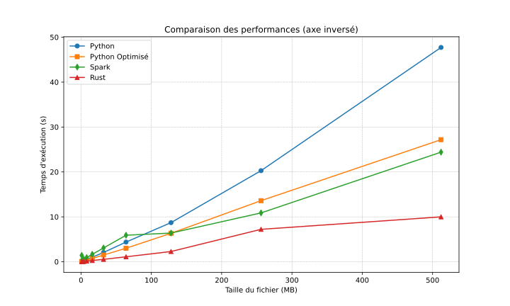

# Benchmark spark

## Méthodologie
Ce rapport présente les résultats d’un benchmark comparant les performances
de différentes implémentations d’un algorithme de comptage de mots.  
L’objectif est de comparer les temps d’exécution et les gains de performance 
(speedup) pour des fichiers de différentes tailles.  
Les données utilisées pour ce benchmark ont été scrapées depuis le projet
Gutenberg, une bibliothèque en ligne de livres numériques. Le téléchargement
des données a pris environ 15 minutes pour générer des fichiers de différentes
tailles (de 1 Mo à 512 Mo).  
Les implémentations sont :

- **Python** : Une implémentation standard en Python.
- **Spark** : Une implémentation utilisant Apache Spark pour le traitement
distribué.
- **Python optimisé** : Une version optimisée de l’algorithme Python, utilisant des techniques de lecture par blocs et de gestion de mémoire plus
efficaces. Le code de cette version est inspiré de l’article de Ben Hoyt.
- **Rust** : Une implémentation naive en Rust.
Les temps d’exécution ont été mesurés pour chaque implémentation, et le
speedup (gain de performance) a été calculé en comparant le temps d’exécution
de Python standard avec celui de PySpark. Les autres implémentations 
(Python optimisé et Rust) sont présentées à titre indicatif.

## Exécution du benchmark

Il faut construire l'image docker :
```bash
docker build -t benchmark-spark .
```

Puis exécuter un container :
```bash
docker run --rm -it benchmark-spark
```

Une fois dans le container il faut scrapper les données (environ 15min) :
```bash
python scrapping.py
```

Et finalement lancer le benchmark : 
```bash
python benchmark.py
```

## Résultat
| Taille (MB) | Python Time (s) | Spark Time (s) | Python optimized Time (s) | Rust Time (s) | Speedup | Mots uniques |
|------------:|---------------:|--------------:|--------------------------:|-------------:|--------:|-------------:|
|          1 |           0.08 |          1.42 |                      0.06 |         0.02 |    0.06 |        11608 | 
|          2 |           0.13 |          0.43 |                      0.09 |         0.04 |    0.29 |        15055 | 
|          4 |           0.25 |          0.56 |                      0.17 |         0.07 |    0.45 |        24084 | 
|          8 |           0.51 |          0.93 |                      0.35 |         0.13 |    0.55 |        43293 | 
|         16 |           1.02 |          1.66 |                      0.73 |         0.27 |    0.61 |        71597 | 
|         32 |           2.06 |          3.06 |                       1.5 |         0.53 |    0.67 |        87417 | 
|         64 |           4.38 |           5.9 |                       3.0 |          1.1 |    0.74 |       116658 | 
|        128 |           8.71 |          6.39 |                      6.34 |         2.28 |    1.36 |       176913 | 
|        256 |          20.28 |         10.88 |                      13.6 |         7.22 |    1.86 |       356523 | 
|        512 |          47.72 |         24.41 |                     27.18 |         9.99 |    1.96 |       689491 | 



